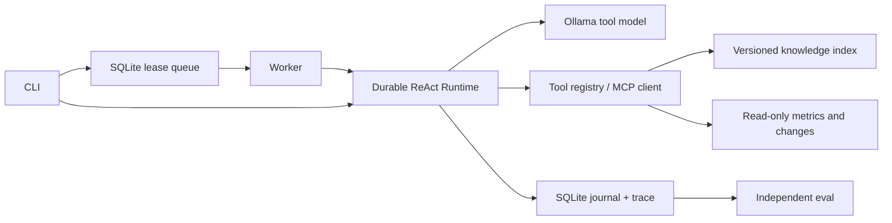

# Byte Agent Platform

面向研发服务诊断的 Python Agent 平台：ReAct 工具循环、可恢复会话、RAG 证据检索、官方 MCP 服务与客户端、显式 Skill 工作流，以及带租约与 fencing 的多进程任务队列。配套 [Byte Agent Eval](https://github.com/chendi-Shi/byte-agent-eval) 独立验收决策与证据。

项目以公开代码调研为起点进行独立实现。运行手册、指标和公开实验均为合成资料；支持接入操作者指定的现有 Markdown/SQLite 数据源。实际模型结果与失败轨迹见配套项目 [实验记录](https://github.com/chendi-Shi/byte-agent-eval/blob/main/examples/model-results.md)。

## 安装与演示

Python 3.11+，核心运行时无第三方依赖；正式 MCP 接入使用官方 Python SDK。

```bash
python -m pip install -e '.[mcp]'
python -m unittest discover -s tests -v
python -m byte_agent demo
python -m byte_agent dataset --data runs/corpus
```

`demo` 是显式 Scripted 工程夹具，不是模型效果。`dataset` 生成 32 个独立服务案例（24 dev、8 holdout）、31 份手册、指标/变更库与词法索引；一例刻意没有手册。验收标签位于 services.json，仅供 evaluator 使用，工具不会读取标签。

本地安装 Ollama 与支持工具调用的模型后：

```bash
python -m byte_agent run --data runs/corpus --model qwen3:4b-instruct --model-context 6144 --model-output 512 --timeout 300 --max-tokens 48000 --skill skills/incident-analysis/SKILL.md --task "Diagnose growth-feed at minute 59 using the latest 30-minute metrics, runbook and current changes. Return the incident-analysis JSON decision." --output runs/incident-01
```

模型由操作者提前安装；程序不会自动下载权重。Ollama 的模型 digest、量化、版本、模板指纹、seed、上下文/输出设置进入 run 身份。旧 Qwen Go 模板存在工具 schema 序列化问题时，可创建保留原权重的新标签：

```bash
python -m byte_agent prepare-model --model qwen3:0.6b --target qwen3:0.6b-byte
```

这是模板兼容修复，不是训练，也不保证小模型具备任务能力；0.6B 探针失败已保留。新实验须使用新的 `--output`。完整 trace 包含消息、工具输入/输出、引用、耗时、provider token 与结束原因。

## 数据与知识接入

三种受限工具共用一个注册表：

| 工具 | 输入 | 返回 |
|---|---|---|
| knowledge_search | query、严格 service/source 过滤、limit | 版本化 runbook 片段和引用 id |
| service_metrics | service、window_minutes | 聚合错误率、baseline/recent、最新时间、缺失状态 |
| incident_changes | service、limit | 发布、依赖、流量与遥测观测，状态、时间和证据 id |

数据 schema 与 connector 示例见 [examples/corpus](examples/corpus/README.md)。连接配置只接受 `knowledge_root` 和 `metrics_database` 两个路径，路径相对配置文件解析：

```bash
python -m byte_agent ingest --connection /path/to/connection.json --data runs/existing
python -m byte_agent run --connection /path/to/connection.json --data runs/existing --model YOUR_MODEL --skill skills/incident-analysis/SKILL.md --task "Diagnose your service" --output runs/existing-01
```

源 SQLite 使用只读连接；缺失或不兼容数据明确报错，不用合成值替代。公开测试验证源库没有被改写。

知识索引采用 Markdown 段落分块、BM25 与可选 Embedding 余弦排名的 RRF；更换模型后重新索引。启用混合检索时先 `ingest --knowledge DIR --embedding-model MODEL`，运行使用相同 `--embedding-model MODEL`。引用 id 绑定路径、片段位置和内容；重建删除旧快照。没有 GraphRAG 实现。

## MCP 与 Skill

`--sdk` 使用官方 SDK 完成 stdio 初始化协商、发现、工具调用与错误返回；内置 async/sync MCP client 可以将明确允许的远端工具接入 Runtime。MCP 配置示例：

```json
{"mcpServers":{"byte-agent-tools":{"command":"python","args":["-m","byte_agent.mcp","--data","/absolute/path/to/runs/corpus","--sdk"]}}}
```

准备数据后，可在同一运行命令添加 `--transport mcp`，实际经过子进程服务和官方 client。未加 `--sdk` 的旧 JSON-lines 子集仅保留作离线兼容，不作为完整 MCP 协议实现。

`--skill` 加载操作者明确选择的带 name/description 元数据的 Markdown 工作流，内容与 hash 参与执行身份。知识检索不能安装 Skill。内置 incident-analysis 工作流要求三类证据、限定 JSON 决策、区分缺失/冲突与因果不确定性。

## 多进程任务队列

```bash
python -m byte_agent enqueue --queue runs/jobs.sqlite --idempotency-key incident-growth-001 --task "Diagnose growth-feed with incident-analysis JSON."
python -m byte_agent worker --queue runs/jobs.sqlite --data runs/corpus --model YOUR_MODEL --skill skills/incident-analysis/SKILL.md --output runs/jobs --worker-id worker-1 --once
python -m byte_agent status --queue runs/jobs.sqlite --job-id ID
python -m byte_agent cancel --queue runs/jobs.sqlite --job-id ID
```

可启动多个 worker 进程。SQLite 原子 claim、持久化幂等键、续租、过期重领、尝试上限和 fencing token 防止旧 worker 覆盖新结果。测试包括跨进程竞争、hard crash、长调用续租和取消。每个 job 使用独立 durable run。

队列的 `completed` 表示 callback 交付结果；须同时检查 `result.agent_status` 与 `requires_review`。模型响应丢失为 `uncertain`，同一 run 不会自动再次调用；取消在安全边界生效，不能强行打断已经发出的模型请求。

## 架构与验证边界



模型请求前记录 inflight；模型决策与 pending 工具计划事务落库；只读工具允许重放。单 run 使用 OS 锁。身份绑定源码、模型配置、工具 schema、数据内容、任务和预算，防止恢复到不同实验。

工具白名单、参数化查询与输出大小限制提供明确能力边界；提示与“不可信证据”标记本身不能保证抵御所有注入。Token 阈值按 provider 返回值在请求后检查，可能多消耗一条请求；未知用量单独记录。

SQLite 队列适用于单机本地磁盘，采用 at-least-once 只读执行，不是多机分布式服务，也不提供任意副作用 exactly-once、多租户授权或生产规模结论。没有执行 LLM SFT/RL 训练或 Multi-Agent 优化。项目的实际贡献是可验证的 Agent 基建、业务应用、协议互操作和评测闭环。

[设计与开源来源](docs/design.md) · [JD 对应](docs/jd-map.md) · [面试与演示](docs/interview.md)
