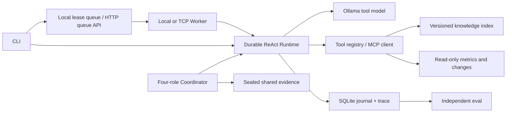

# Byte Agent Platform

面向研发服务诊断的 Python Agent 平台：可恢复 ReAct、RAG 证据检索、官方 MCP、显式 Skill、四角色 Multi-Agent 编排，以及带租约与 fencing 的本地队列和 Waitress HTTP 中央队列。远端 worker 通过 TCP 运行实际 Runtime，使用各自的本地数据和日志。配套 [Byte Agent Eval](https://github.com/chendi-Shi/byte-agent-eval) 独立验收决策与证据。

项目以公开代码调研为起点进行独立实现。运行手册、指标和公开实验均为合成资料；支持接入操作者指定的现有 Markdown/SQLite 数据源。历史 V2 已通过 77 项平台测试，真实 Qwen3 4B 单 Agent 验证模式开发回归为 2/2、留出集为 7/8，真实 BGE-M3 Embedding 与混合检索也已运行；配置和失败记录保留在 [实测记录](examples/model-results.md)。这些历史成绩不能当作 V3 Multi-Agent、网络 worker 或训练后的成绩。

V3 的 HTTP 队列新增 12 项测试已通过。真实 Waitress 服务端与三个独立 TCP worker 已完成 24/24 条 Scripted 模型驱动的实际 Runtime／工具／验证器任务；终止一个已领取任务的进程后，第 2 次领取恢复，旧 token 提交被拒绝。它证明工程执行链路，模型效果由真实模型报告另行判断。

| V3 实验 | 当前记录范围 | 报告入口 |
|---|---|---|
| Waitress 与三 worker 故障恢复 | 24/24 工程任务；第 2 次领取恢复、拒绝旧 token；同机 TCP，Scripted | [网络报告](examples/experiments/distributed-v3-waitress/report.json) |
| 四角色真实模型运行 | 四角色 completed；动态 Schema 与证据协议通过；业务检查 3/6，整体未通过，保留负面结果；11088 已知 tokens | [Multi-Agent 报告](examples/experiments/multiagent-v3-compact/report.json) |
| 真实 Ollama 网络 worker | creator-upload 独立 oracle 通过；3 工具调用、4067 已知 tokens；同机 TCP | [网络 LLM 报告](examples/experiments/distributed-v3-real-complete/report.json) |
| Ubuntu 真实容器集成 | 候选 CI 镜像构建与队列、两个 demo worker 完成 12/12 数值夹具；单主机，无 LLM | [容器 CI](https://github.com/chendi-Shi/byte-agent-platform/actions/runs/37918991758) |
| 135M LoRA SFT／REINFORCE | 实际参数更新与五项权重验收通过；完整 base／SFT／RL 分数另表记录 | [训练及全部分数](examples/v3-results.md) |

V3 真实模型与权重训练均已完成并核对原始记录：[完整结果](examples/v3-results.md)。四角色运行协议完成，但该开发案例因保守归因未通过业务验收，七次开发尝试全部保留。真实网络模型开发案例通过独立 oracle；135M 训练使用受约束策略和机械渲染器。它们不替代历史 Qwen 留出分数，也不构成生产效果或多物理主机成绩。

## 安装与演示

Python 3.11+，核心运行时无第三方依赖；正式 MCP 接入使用官方 Python SDK，HTTP 部署使用可选 Waitress。

```bash
python -m pip install -e '.[mcp]'
python -m unittest discover -s tests -v
python -m byte_agent demo
python -m byte_agent dataset --data runs/corpus
```

`demo` 是显式 Scripted 工程夹具，不是模型效果。`dataset` 生成 32 个独立服务案例（24 dev、8 holdout）、31 份手册、指标/变更库与词法索引；一例刻意没有手册。验收标签位于 services.json，仅供 evaluator 使用，工具不会读取标签。

先安装并启动 Ollama。首次使用时下载官方 [qwen3:4b](https://ollama.com/library/qwen3:4b)，再创建本项目使用的本地工具模板标签：

```bash
ollama pull qwen3:4b
python -m byte_agent prepare-model --model qwen3:4b --target qwen3:4b-instruct
ollama show qwen3:4b-instruct --modelfile
```

`qwen3:4b-instruct` 是上述命令创建的本地标签，不是要求从模型仓库下载的公开标签。已有实验使用该标签时，先核对其 digest 和模板，保留原身份；不同权重或模板须使用新输出目录。随后运行：

```bash
python -m byte_agent run --data runs/corpus --model qwen3:4b-instruct --model-context 6144 --model-output 512 --timeout 300 --max-tokens 48000 --skill skills/incident-analysis/SKILL.md --task "Diagnose growth-feed at minute 59 using the latest 30-minute metrics, runbook and current changes. Return the incident-analysis JSON decision." --output runs/incident-01
```

模型由操作者提前安装；Agent 程序不会自动下载权重。Ollama 的模型 digest、量化、版本、模板指纹、seed、上下文/输出设置进入 run 身份。`prepare-model` 修复旧 Qwen Go 模板的工具 schema 序列化并保留原权重，属于模板兼容处理；历史 0.6B 探针失败仍保留。完整 trace 包含消息、工具输入/输出、引用、耗时、provider token 与结束原因。四角色配置与复现见 [Multi-Agent 说明](docs/multiagent.md)。

可选的服务范围与答案检查模式：

```bash
python -m byte_agent run --data runs/corpus --model qwen3:4b-instruct --model-context 6144 --model-output 512 --timeout 300 --max-tokens 48000 --service growth-feed --verify --skill skills/incident-analysis/SKILL.md --task "Diagnose growth-feed at minute 59 using its latest 30-minute metrics, runbook and current changes." --output runs/verified-incident-01
```

`--service` 把三种工具的目标服务限定为操作者选定的单值；错误服务在访问数据前被拒绝。`--verify` 检查 JSON 契约、三工具观测、完整窗口错误率与实际返回的目标服务引用；可修复错误回流模型，仍受原预算限制。错误工具历史不能被改写成成功。这个检查不验收根因语义或建议质量，业务结果仍由配套 evaluator 独立判断。`run --verify` 必须同时指定 `--service`。

当前 `--verify` 要求知识来源采用 `service/runbook.md` 等按 service 分目录的布局；普通 `--service` 支持 connector 的平铺文件与 frontmatter 服务标记，生成的合成案例均采用目录布局。

## 数据与知识接入

三种受限工具共用一个注册表：

| 工具 | 输入 | 返回 |
|---|---|---|
| knowledge_search | query、严格 service/source 过滤、limit | 版本化 runbook 片段和引用 id |
| service_metrics | service、window_minutes | 按最新 minute 范围选取的聚合错误率、baseline/recent、最新时间、缺失状态 |
| incident_changes | service、limit | 发布、依赖、流量与遥测观测，状态、时间和证据 id |

数据 schema 与 connector 示例见 [examples/corpus](examples/corpus/README.md)。连接配置只接受 `knowledge_root` 和 `metrics_database` 两个路径，路径相对配置文件解析：

```bash
python -m byte_agent ingest --connection /path/to/connection.json --data runs/existing
python -m byte_agent run --connection /path/to/connection.json --data runs/existing --model YOUR_MODEL --skill skills/incident-analysis/SKILL.md --task "Diagnose your service" --output runs/existing-01
```

源 SQLite 使用只读连接；缺失或不兼容数据明确报错，不用合成值替代。公开测试验证源库没有被改写。

知识索引采用 Markdown 段落分块、BM25 与可选 Embedding 余弦排名的 RRF；更换模型后重新索引。启用混合检索时先 `ingest --knowledge DIR --data runs/hybrid --embedding-model MODEL`，运行使用相同的 `--data runs/hybrid` 与 `--embedding-model MODEL`。引用 id 绑定路径、片段位置和内容；重建删除旧快照。没有 GraphRAG 实现。

真实 Embedding 的最小复现（先由操作者安装 `bge-m3`）：

```bash
python examples/embedding_smoke.py --output runs/embedding-smoke
```

[已保存报告](examples/embedding-smoke.json) 包含模型 digest、5 个片段的 1024 维向量检索、词法/混合排名和耗时；该检查证明执行链路跑通，不证明检索质量提升。

## MCP 与 Skill

`--sdk` 使用官方 SDK 完成 stdio 初始化协商、发现、工具调用与错误返回；内置 async/sync MCP client 可以将明确允许的远端工具接入 Runtime。MCP 配置示例：

```json
{"mcpServers":{"byte-agent-tools":{"command":"python","args":["-m","byte_agent.mcp","--data","/absolute/path/to/runs/corpus","--sdk"]}}}
```

准备数据后，可在同一运行命令添加 `--transport mcp`，实际经过子进程服务和官方 client。该模式使用已准备的 `--data` 快照，不能同时直接指定 `--connection` 或 `--embedding-model`。SDK 断连与超时归一化为工具错误，写入执行轨迹。未加 `--sdk` 的旧 JSON-lines 子集仅保留作离线兼容，不作为完整 MCP 协议实现。

`--skill` 加载操作者明确选择的带 name/description 元数据的 Markdown 工作流。loader 提供原始文件 SHA 用于标识；执行身份实际绑定解析后的 name 与 instructions，原始 SHA 和全部 metadata 不进入身份。知识检索不能安装 Skill。内置 incident-analysis 工作流要求三类证据、限定 JSON 决策、区分缺失/冲突与因果不确定性。

## 多进程任务队列

```bash
python -m byte_agent enqueue --queue runs/jobs.sqlite --service growth-feed --idempotency-key incident-growth-001 --task "Diagnose growth-feed with incident-analysis JSON."
python -m byte_agent worker --queue runs/jobs.sqlite --data runs/corpus --model YOUR_MODEL --verify --skill skills/incident-analysis/SKILL.md --output runs/jobs --worker-id worker-1 --once
python -m byte_agent status --queue runs/jobs.sqlite --job-id ID
python -m byte_agent cancel --queue runs/jobs.sqlite --job-id ID
```

可启动多个 worker 进程。SQLite 原子 claim、持久化幂等键、续租、过期重领、尝试上限和 fencing token 防止旧 worker 覆盖新结果。测试包括跨进程竞争、hard crash、长调用续租和取消。每个 job 使用独立 durable run。

`enqueue --service` 把授权服务保存到 job payload；worker 按这个服务限定工具，验证模式额外创建 validator，也可用 worker 的 `--service` 作为显式默认范围。丢失租约停止旧 attempt 并保留恢复状态，用户取消才持久化 cancelled。替代 worker 等待旧 run 的 writer 锁，不把短暂锁忙快速计成多次任务失败。

队列的 `completed` 表示 callback 交付结果；须同时检查 `result.agent_status` 与 `requires_review`。模型响应丢失为 `uncertain`，同一 run 不会自动再次调用；取消在安全边界生效，不能强行打断已经发出的模型请求。

## 四角色 Multi-Agent

[Coordinator 与 RoleOllama](src/byte_agent/multiagent.py) 顺序运行四个独立模型适配器：指标 Agent 只读 `service_metrics`，知识 Agent 只读手册和变化记录，reviewer 审查两份提案，arbiter 输出最终诊断。角色可以共享同一模型权重，但各自有提示、工具能力、Runtime 日志与角色预算；当前实现没有并行角色执行。

专家的实际观测和提案封存为带 SHA256 的不可变快照。reviewer／arbiter 通过受限的 `read_shared_evidence` 读取指定快照；其他 Agent 的输出仍是不可信证据。指标角色没有因果观测，必须保留 `insufficient_evidence`。冲突不会被多数投票掩盖，最终检查要求保留冲突与 `verify_changes`。

`RoleOllama` 在成功取得该角色必需的实际工具观测后，才从原生工具调用切换为 JSON Schema 约束输出。Schema 约束字段和枚举，不填入测量值、引用 id 或答案标签；独立 validator 继续检查证据和契约。团队预算累计角色用量，角色失败、超时或未知 provider 响应停止团队，不退化成单 Agent 并声明成功。

```bash
python examples/multiagent_demo.py --fixture --output runs/multiagent-fixture
python examples/multiagent_demo.py --model qwen3:4b-instruct --output runs/multiagent-real
```

示例使用新合成开发场景 `demo-upload-v3`，不读取原 benchmark 的 holdout。`--fixture` 仅用于工程演示；真实输出与失败以其 `experiment.json`、各角色 trace 和 `team-trace.json` 为准。多角色实现本身不证明比单 Agent 更准确或更省 token。

## HTTP 中央队列与远端 worker

```bash
python -m pip install -r requirements-distributed.txt
python examples/distributed_demo.py --output runs/network-smoke --server-implementation waitress
```

部署入口为 `python -m byte_agent.distributed serve` 和 `agent-worker`；服务端独占本地 SQLite，worker 只通过 HTTP(S) 领取、续租和交付结果。随机 `QUEUE_TOKEN` 由部署环境注入；默认只监听 loopback，跨主机部署需要私网防火墙与 HTTPS 代理。客户端不跟随重定向，不自动重发结果未知的队列变更。

真实模型的单任务复现使用相邻评测仓库进行执行后独立评分：

```bash
python examples/distributed_llm_demo.py --data runs/corpus --output runs/network-real
```

这个脚本创建独立 Waitress 与真实 `agent-worker` 进程，启用 Skill 和 verify；worker 不接收 `services.json`，开发案例标签仅由父进程在执行后用于 oracle。详细部署、故障语义、Compose 配置与限制见 [distributed.md](docs/distributed.md)。

## 架构与验证边界



模型请求前记录 inflight；模型决策与 pending 工具计划事务落库；只读工具允许重放。单 run 使用 OS 锁。身份绑定源码、模型配置、工具 schema、数据内容、任务、预算与可选 validator revision，防止恢复到不同实验。

工具白名单、参数化查询与输出大小限制提供明确能力边界；提示与“不可信证据”标记本身不能保证抵御所有注入。Token 阈值按 provider 返回值在请求后检查，可能多消耗一条请求；未知用量单独记录。

SQLite 文件只用于拥有它的主机本地磁盘；HTTP 模式把队列状态集中在 API 主机，设计上可服务其他主机的 worker，当前实测只有同一物理 Windows 主机上的独立 TCP 进程。没有多个物理主机、复制高可用、大规模压测、多租户授权或生产 SLA 证据。执行为 at-least-once，只对当前租约 owner 的队列结果做 fencing，不保证任意外部副作用 exactly-once。

训练候选数据、模板修复、结构化解码和多角色编排各有独立作用；它们不属于权重训练。配套仓库另行完成 pinned SmolLM2-135M 的实际 LoRA SFT／REINFORCE；[V3 完整结果](examples/v3-results.md) 保留每阶段分数、实际损失、梯度和权重 SHA256。候选 commit 的 GitHub CI：平台在 Windows、Ubuntu 各 140 项通过且无跳过；评测核心在两系统各运行 51 项，其中 44 项通过、7 项因训练依赖跳过。独立 training-contracts job 实际通过 9 项训练环境测试和 7 项策略测试；后者逐个覆盖核心跳过项，合并为 51 个不同测试，重复测试不累加。这些是候选 CI 结果；最终 main CI 另行核验，本机失败记录保留。

[设计与开源来源](docs/design.md) · [JD 对应](docs/jd-map.md) · [面试与演示](docs/interview.md)
