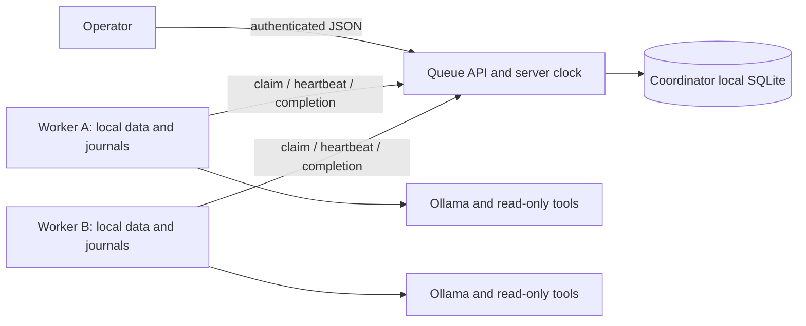

# Central queue and remote Agent workers

The queue API owns a SQLite WAL database on **its own local disk**. Workers use
HTTP(S) over TCP and do not mount or open the queue database. Each worker has its
own prepared knowledge/metrics snapshot and its own Runtime journals. An
`AgentJobHandler` runs the actual ReAct Runtime, service-scoped read-only tools,
optional trusted Skill, Ollama model and optional diagnostic verifier.



This is a single-coordinator distributed execution design. The coordinator is
a single point of failure and a throughput bottleneck. It is not a replicated
Redis/Postgres deployment, distributed database, or high-availability claim.

## Guarantees and failure semantics

- Enqueue idempotency keys bind task, JSON payload and retry policy. Reusing a
  key for different input is rejected.
- Claim/reclaim uses one `BEGIN IMMEDIATE` transaction. Every attempt has a fresh
  random fencing token. Only the current unexpired owner can heartbeat, fail or
  commit a result; all lease decisions use the API host's clock.
- Expired claims return to the queue until `max_attempts` is exhausted. Running
  cancellation is cooperative, and cancelled results are discarded.
- Workers renew leases during blocking inference. Loss of ownership stops
  subsequent work and rejects a late completion. A network failure can leave a
  mutation outcome unknown; the client never automatically replays mutations.
  Size the lease above normal request latency and scheduling pauses; the default
  is 30 seconds with renewal every 10 seconds. A lease is bounded to one hour.
- Execution is **at-least-once**. Queue fencing protects committed queue results,
  not arbitrary external side effects. Keep callbacks read-only or use a
  separate durable idempotency/fencing protocol at the effect destination.
- A replacement on a different node can re-run a read-only job from scratch.
  It cannot resume another node's local journal. Same-node journals retain the
  Runtime's explicit uncertain-provider-response policy. Durable trace storage
  across nodes requires a separate artifact store; a local trace path in a job
  result names the worker's artifact, not a file served by this API.
- The shared bearer credential grants operator access. There is no per-tenant
  authorization or isolation. Task payloads cannot upload executable code,
  select filesystem paths, choose models or override the worker's service scope.

## Install and local run

```bash
python -m pip install -e .
python -m pip install -r requirements-distributed.txt
```

Generate a fresh secret in a process environment or a secret manager. Do not
commit a `.env`, write it to reports or place it in a URL. The API requires a
32–512 character ASCII `QUEUE_TOKEN` without whitespace. Both API and workers
receive the same environment variable. The following commands assume it is set.

```bash
python -m byte_agent.distributed serve --database runs/coordinator/jobs.db
# In another process, after preparing this node's local data:
byte-agent dataset --data runs/node-a/data
python -m byte_agent.distributed agent-worker \
  --url http://127.0.0.1:8765 --data runs/node-a/data \
  --output runs/node-a/jobs --model qwen3:4b-instruct --verify \
  --skill skills/incident-analysis/SKILL.md
```

The `dataset` command creates explicitly fictional data. For existing data use
an operator-owned `--connection connection.json` or a prepared local snapshot.
The Agent worker does not silently manufacture missing data.

Submit using the Python client (the secret remains in the environment):

```python
import os
from byte_agent.distributed import HTTPJobQueue

queue = HTTPJobQueue("http://127.0.0.1:8765", os.environ["QUEUE_TOKEN"])
job = queue.enqueue(
    "Diagnose creator-upload using current 30-minute metrics, its own runbook "
    "and current change observations. Return the diagnostic JSON object.",
    {"service": "creator-upload"},
    idempotency_key="creator-upload-incident-2026-10-09",
)
print(job.id)
print(queue.get(job.id).status)
# queue.cancel(job.id)
```

Worker configuration controls model/context/budgets/Skill and an optional fixed
`--service`. A conflicting job service is rejected. `--once` processes one
claimed task, which makes an actual LLM smoke run bounded and reproducible.

## Docker Compose and multiple hosts

```bash
docker compose -p byte-agent-distributed --profile demo up -d --build --scale worker=2
docker compose -p byte-agent-distributed --profile demo down
```

The `demo` profile runs a Waitress API and two **synthetic numeric callback**
workers when scaled as above. This is separate from the recorded 24-task
Scripted ReAct experiment and from the optional real Agent profile. A Dockerfile
installs the package and pinned Waitress at build time, runs Python 3.12 as uid
10001, and contains only allowlisted application source and the trusted Skill.
The complete checkout, runs, credentials and model weights are excluded from
build context; only the allowlisted source/configuration/Skill files enter the
image. Workers wait for the queue health check. No worker mounts the
coordinator's SQLite volume. Do not enable `demo` and `agent` workers against
the same queue: the numeric callback cannot process Agent jobs.

For the real `agent` profile, first prepare two **consistent, closed SQLite
backup files**. The following example uses fictional dataset inputs; an existing
operator-owned index/database may be backed up in the same way. SQLite backup
includes committed WAL data; copying only a live database's main file does not.

```bash
python -m byte_agent dataset --data runs/container-corpus
python - <<'PY'
from pathlib import Path
import sqlite3
source = Path("runs/container-corpus").resolve()
target = Path("runs/deployment-snapshot")
target.mkdir(parents=True, exist_ok=False)
for name in ("knowledge.sqlite", "metrics.sqlite"):
    original = sqlite3.connect((source / name).as_uri() + "?mode=ro", uri=True)
    snapshot = sqlite3.connect(target / name)
    try:
        original.backup(snapshot)
    finally:
        snapshot.close()
        original.close()
PY
docker compose -p byte-agent-distributed --profile agent up -d --build
docker compose -p byte-agent-distributed --profile agent down
```

Set `AGENT_DATA` to another prepared snapshot directory when needed. Compose
binds only `knowledge.sqlite` and `metrics.sqlite` as read-only input files;
missing sources fail instead of creating directories. `services.json`, labels,
source Markdown and other corpus files are not mounted. The Dockerfile's
bootstrap reads these closed input snapshots with SQLite `mode=ro&immutable=1`
and backs them up into each worker's **own writable** `/worker/data`. This use of
`immutable` requires frozen snapshots: do not bind a live database or change an
input file while a worker starts. Input consistency is the operator's staging
responsibility; file-only mounts cannot observe an unmounted host WAL.

This local writable copy is necessary because `Knowledge.__init__` executes
schema setup and may migrate an older index. Pointing `--data` directly at a
read-only source mount would fail when a migration is required. Tool queries
still open metrics read-only. `agent-a-state` and `agent-b-state` are separate
named volumes containing local data and per-job Runtime journals; neither is
the queue volume. Do not scale `agent-a` or `agent-b` into replicas sharing its
state volume. For another worker, give it a distinct state volume and worker ID.
Ordinary `down` retains named volumes; removing state volumes removes local
recovery journals. Input replacement invalidates existing run identities if
content changes, so use a new experiment/job rather than reusing old journals.

The Agent profile invokes the existing `agent-worker` with service payload
scope, `--verify`, the trusted incident-analysis Skill, context 3072, output 384
and timeout 900. It polls continuously; the CLI's `--once` remains available for
bounded local/manual runs. `AGENT_MODEL` defaults to `qwen3:4b-instruct`; the
model must already be installed. No model is downloaded by the container.
`OLLAMA_BASE_URL` defaults to `http://host.docker.internal:11434`, with the
`host-gateway` mapping supplied for Linux Docker. Loopback inside a container
is the container itself. The host Ollama endpoint must actually listen on an
interface reachable from Docker, and its firewall must permit the intended
container subnet; an Ollama server bound only to host `127.0.0.1` may not be
reachable through the gateway. Alternatively set `OLLAMA_BASE_URL` to an
operator-controlled private model endpoint. Keep that listener restricted to
the private Docker/network clients rather than exposing an unauthenticated
model API publicly.

For deployment across physical hosts, install the package/image on each host,
prepare that node's local input/state and point `--url` at the private API
origin. This Compose file describes containers on one Docker host, not
cross-machine placement. Existing volumes created by an older root-user image
must be made writable by uid 10001 during a controlled migration; the image
initializes ownership only for new volumes.

The default API binds to loopback and Compose exposes only a loopback host
port. For cross-host deployment, configure a private reverse proxy with HTTPS,
use a certificate validated by the client, restrict access with a firewall and
bind the backend only to the proxy/private network. Configure trusted proxy
headers explicitly rather than trusting arbitrary forwarded headers. Waitress
does not provide TLS by itself. The stdlib `--demo-server` is restricted to
loopback and is only for tests and local demonstrations.

## Ubuntu CI container integration

The `container-smoke` job in [CI](../.github/workflows/ci.yml) builds the
Dockerfile, starts one Waitress queue and two `demo` worker containers on its
Ubuntu runner, submits 12 explicitly synthetic numeric callback tasks, and checks
authenticated transport, idempotent submission, completed state and exact
doubled results. It does not invoke an Agent, Ollama or training. Both worker
containers must remain running; the report records the actual completion
distribution without assuming scheduler fairness. This is a same-host container
integration check, not multi-physical-host or model accuracy evidence.

```bash
python examples/container_smoke.py --output runs/container-smoke-new --jobs 12
```

The script generates a fresh bearer only in its subprocess environment,
redacts it from diagnostics, and uses a random task-owned Compose project.
Its `finally` removes only that project's containers and volumes, without
global Docker cleanup. CI uploads the actual `report.json` even on failure;
the report distinguishes successful image build, attempted container execution,
individual fixture results and cleanup. The [candidate Ubuntu workflow](https://github.com/chendi-Shi/byte-agent-platform/actions/runs/37918991758)
passed all three jobs at commit `a14ea74845dd3e2a3467955bd2d1fd7e6e5bdff2`.
Its container job `113782072499` actually built the image, ran the queue and two
demo workers, and completed 12/12 tasks with `physical_hosts=1`, `fixture=true`,
`real_llm=false`. The raw distribution records all 12 completed jobs on the same
worker, although both worker containers were running; this does not establish
fairness or parallel throughput. The uploaded artifact is `11611028427`, with
downloaded ZIP SHA-256 verified against GitHub:
`54b978543af2b229fe72d01fb76dc3f8fe6de3b9730c50a35e9720432d329362`.
The extracted [raw report](../examples/experiments/container-ci-v3/report.json)
is preserved byte-for-byte; [public provenance](../examples/experiments/container-ci-v3/provenance.json)
binds it to the exact commit, workflow, job, artifact and checksums without
publishing the temporary download URL.
This is candidate-branch evidence; final main CI is checked separately.
[Windows host/static checks](../examples/container-validation-v3.json) remain
`image_built=false` and `containers_executed=false`: the local Desktop failure and
the successful Ubuntu execution are different environments and both are retained.

## Reproduce the recorded TCP/Agent experiment

```bash
python examples/distributed_demo.py --output runs/distributed-demo --jobs 24
python examples/distributed_demo.py --output runs/distributed-waitress --jobs 24 --server-implementation waitress
python -m unittest discover -s tests -p 'test_distributed.py' -v
```

The experiment starts an independent API process, deliberately terminates a
claimed worker, then starts three independent Agent workers with distinct local
data/journal directories. It checks all 24 real Runtime/tool/verifier executions,
server lease recovery, submission idempotency and rejection of the killed
worker's stale completion. `report.json` records process IDs, actual per-worker
counts, attempt counts, relative trace paths, checksums and acceptance outcomes.
The model is explicitly `Scripted`; its traces test engineering integration and
are not LLM quality scores or training samples.

One Windows host with multiple processes over loopback TCP is not evidence of
multiple physical hosts, container execution or production load. Publish the
actual report alongside this distinction. Docker availability and any separate
real Ollama/container results must be reported separately, without converting a
deployment recipe into an executed result.

The completed local Waitress experiment recorded 24/24 completed Runtime runs,
three tool calls and one valid output check per run, with tasks distributed
9/7/8 across the three worker processes. The deliberately killed claim was
recovered on attempt 2, its stale completion was rejected, and there were zero
duplicate final results. The original Compose file was accepted by `docker compose
config --quiet`; containers were not started. A later static deployment audit
added separate demo/Agent profiles, private writable worker snapshots, model
gateway configuration and an allowlisted build context. The revised profiles
have configuration/bootstrap validation on this Windows host. Docker Desktop's
local backend failed while renaming its own `sailor-ingest.sock`, so the host
supplied TCP/WSGI evidence. The later Ubuntu candidate CI separately built and
executed the containers with 12/12 synthetic tasks, as recorded above. Neither
environment establishes a multi-physical-host result.

References: Python's [http.server security warning](https://docs.python.org/3/library/http.server.html),
[Waitress deployment documentation](https://docs.pylonsproject.org/projects/waitress/en/stable/),
and [Waitress reverse proxy configuration](https://docs.pylonsproject.org/projects/waitress/en/stable/reverse-proxy.html).
The container recipe follows Docker's [Compose profiles](https://docs.docker.com/compose/how-tos/profiles/),
[service attributes](https://docs.docker.com/reference/compose-file/services/),
and [build context](https://docs.docker.com/build/concepts/context/) documentation.
