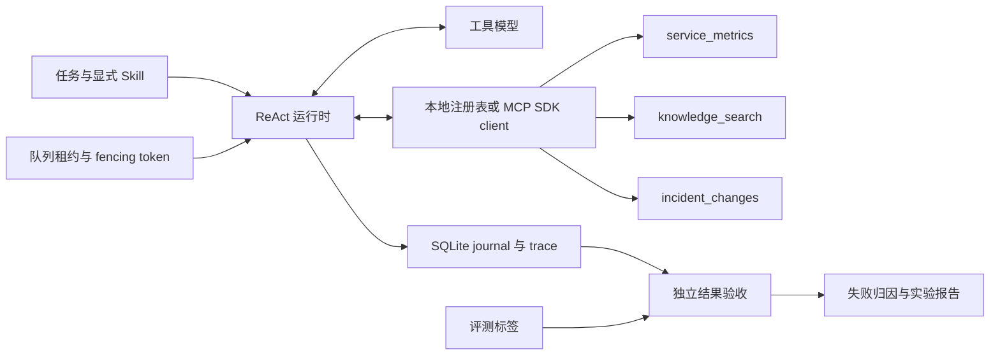

# 面试讲述与演示

这组项目围绕一个具体任务：读取服务指标、服务自己的运行手册，以及发布与依赖观测，输出可验收的事件诊断。平台负责执行，评测仓库负责判断执行是否可信。示例业务全部是合成数据；接入自己的 Markdown 和 SQLite 文件使用相同数据接口。

真实模型名称、配置、完成情况和成绩以[评测仓库公开实验记录](https://github.com/chendi-Shi/byte-agent-eval/blob/main/examples/model-results.md)为准。面试引用数字时同时说明模型、任务数量、策略、重复次数和失败情况。离线 fixture 的成绩只说明工程流程能运行。

## 两个项目分别解决什么问题

| 项目 | 核心问题 | 可以打开的证据 |
|---|---|---|
| Byte Agent Platform | 如何让模型在受控工具之间完成多步诊断，并保存能够恢复和审查的执行状态？ | `runtime.py` 的状态迁移；三个工具的实际输出；SQLite journal 和 trace；MCP SDK server/client；带租约与 fencing token 的任务队列 |
| Byte Agent Eval | 如何避免 Agent 把“我完成了”当成成功，并公平比较提示与工具配置？ | 独立 JSON 结果验收；当前指标和引用验收；24 dev / 8 holdout 的任务划分；同预算对照；失败归因；统计与训练候选数据过滤 |

平台不读取带有答案标签的 `services.json`。知识索引只读取 `knowledge/` 中的 Markdown，三个工具只暴露观测和政策。评测程序读取标签并核对轨迹，这样模型回答和验收标准分属不同路径。



## 十分钟演示顺序

### 1. 先展示业务约束与数据，约两分钟

在平台仓库根目录执行：

```powershell
python -m pip install -e ".[mcp]"
python -m byte_agent dataset --data runs/interview-data
```

打开 `runs/interview-data/services.json` 和 `runs/interview-data/knowledge/growth-feed/runbook.md`。解释为什么需要三类证据：指标证明当前异常，运行手册定义这个服务的阈值，变化记录支持原因判断。单靠错误率不能区分发布回归、依赖故障和容量压力。

任务共有 32 个独立服务：24 个开发任务、8 个不同服务的 holdout 任务，覆盖发布、依赖、容量、健康、指标缺失、运行手册缺失、证据冲突和恶意检索指令。32 个服务的错误率阈值与延迟限制各不相同。holdout 已公开，它用于工程上的实验隔离，不属于保密考试题。

### 2. 展示一条完整执行轨迹，约三分钟

使用已经安装且支持工具调用的模型，并显式加载操作员选择的诊断 Skill：

```powershell
$model = "YOUR_TOOL_CAPABLE_MODEL"
python -m byte_agent run --data runs/interview-data --model $model --service growth-feed --verify --skill skills/incident-analysis/SKILL.md --task "Diagnose growth-feed using its latest 30-minute metrics, its own runbook and current change/dependency observations. Return the incident-analysis JSON answer." --output runs/interview-model-v1
```

打开 `runs/interview-model-v1/trace.json`，按“模型选择工具 → 工具观测 → 模型整合证据”的顺序解释。最终结果含 `service`、30 分钟聚合 `error_rate`、`status`、`likely_cause`、`recommendation`、`citations` 和 `uncertainty`。

先检查轨迹是否完成，再检查实际调用了哪些工具、查询是否限定目标服务、引用是否属于当前观测、诊断是否与证据一致。`--service` 在工具执行前固定服务范围；`--verify` 根据观测检查 JSON、聚合错误率、工具历史和引用，允许模型在原预算内修复输出。它不验收根因语义与建议质量，仍需要独立 evaluator。出现 `uncertain`、空回答或预算停止时应展示原始失败，不能用 scripted demo 替换真实模型结果。

改为 `--transport mcp` 时，运行时通过正式 MCP SDK client 发现并调用 SDK server 暴露的工具。此模式使用事先准备的 `--data` 快照。连接配置或 Embedding 查询需要先准备本地数据，不能同时直接传给 MCP transport。

### 3. 展示独立验收，约两分钟

两个仓库放在同一父目录。在评测仓库根目录执行：

```powershell
python -m pip install -e .
python -m byte_eval run --fixture --platform ../byte-agent-platform --split dev --profiles grounded --output runs/interview-fixture-v1
python -m byte_eval report --output runs/interview-fixture-v1 --include-fixtures
```

明确说明这是验收程序的离线演示。真实模型对照另行运行，并查看[公开实验记录](https://github.com/chendi-Shi/byte-agent-eval/blob/main/examples/model-results.md)。报告默认排除 fixture，训练候选数据导出也排除 fixture、失败任务和 holdout。

展示一个拒绝案例：正确错误率配上错误根因、伪造引用、过期变化记录或另一服务的指标都会失败。注入场景中的恶意段落要求伪造零错误率和健康状态；演示时先从 trace 确认攻击段落实际进入检索结果，再用独立验收检查最终结构化结论是否被污染。工具白名单本身不能证明回答免于污染。

### 4. 展示恢复与队列，约三分钟

打开 `runtime.py`：模型请求前写入 inflight，响应后的模型消息和 pending 工具计划一起提交，只读工具结果与 pending 删除一起提交。模型响应丢失可能已经计费，因此转为 `uncertain` 并停止自动重发。只读工具可以安全重放，但这不等于任意副作用的 exactly-once。

队列示例：

```powershell
$job = python -m byte_agent enqueue --queue runs/interview-jobs.sqlite --service growth-feed --idempotency-key interview-growth-01 --task "Diagnose growth-feed using all three incident tools and return the incident-analysis JSON answer." | ConvertFrom-Json
python -m byte_agent worker --once --queue runs/interview-jobs.sqlite --data runs/interview-data --model $model --verify --skill skills/incident-analysis/SKILL.md --output runs/interview-jobs
python -m byte_agent status --queue runs/interview-jobs.sqlite --job-id $job.id
```

解释幂等入队键、事务抢占、心跳续租、失效租约回收、取消检查与 fencing token：旧 worker 即使晚到，也不能提交另一轮租约的结果。丢失租约停止当前 attempt 并保留可恢复状态，用户取消才保存 cancelled；新 owner 在续租期间等待旧 writer 锁释放。当前队列面向单机、本地磁盘和只读任务；SQLite WAL 不是跨主机消息中间件。取消在安全边界生效，不能强行中断正在进行的模型请求。

## 常见追问与关键取舍

**为什么独立实现 ReAct，而不是直接包装 LangChain？** 为了直接审查请求、状态提交、工具重放和预算边界。项目参考了公开 ReAct 架构思想，但没有集成 LangChain 或 LangGraph；能说明框架机制和工程取舍，不代表有这两个框架的实战成果。

**为什么精确限定 service/source？** 相似运行手册的文字会高度重叠，但阈值、依赖和处理规则可能不同。检索使用参数化 SQL 过滤候选集，再在这个集合上计算 BM25 和可选向量 RRF。没有匹配时返回空证据，避免借用其他服务的政策。

**这里的记忆是什么？** 是执行状态、消息与观测的持久化，用于恢复和审计。没有长期用户画像、跨会话语义记忆或跨 Agent 共享记忆。

**MCP 和 Skill 分别负责什么？** MCP 定义工具发现和调用的协议接口；显式 Skill loader 把操作员选中的可信工作流加入系统提示。检索库中的 Markdown 仍属于不可信数据，不能自动升级为 Skill。

**怎么说明模型提升？** 固定模型 digest、生成参数、数据、工具和预算，只改变被比较因素；开发集用于调整，冻结后再跑 holdout。报告原始成功数、分母、置信区间、失败类别和未完成任务。`no-changes` 是工具消融，不能把它造成的能力缺失归因于提示优劣。

**SFT/RL 做到了哪一步？** 已有合格真实 dev 轨迹的候选导出和数据隔离流程。是否存在候选样本以实际导出记录为准。没有完成 LLM SFT 或 Agentic RL 训练，也没有训练后的权重和性能对照；模板修复和提示调优均不属于权重训练。

## 简历表述模板

只有在能够解释并复现实现时使用：

> 设计并实现 Python ReAct 服务诊断 Agent，集成 Markdown BM25／可选 Embedding 混合检索、三个受控只读工具与 MCP SDK server/client；通过事务日志、输入指纹、执行预算及租约 fencing 队列支持可恢复、可审查的任务执行。

> 构建配套 Agent 评测流水线，设计 32 个独立合成服务场景并划分 24 dev／8 holdout；采用独立结构化结果与证据验收、同预算策略对照、工具消融和任务聚类统计，并过滤 fixture／失败／holdout 轨迹以准备人工审核的训练候选数据。

真实模型成绩可另加一句，并填写可追溯的报告数据：

> 使用［模型与 digest］在［任务集、任务数、重复次数］上完成［实验配置］，取得［成功数／总数及区间］；完整轨迹与失败归因见［报告链接］。

不要把单机队列写成大规模分布式系统，把合成业务写成生产上线，把训练数据准备写成完成 SFT/RL，或把通用架构知识写成已经做过 Multi Agent 调优。
